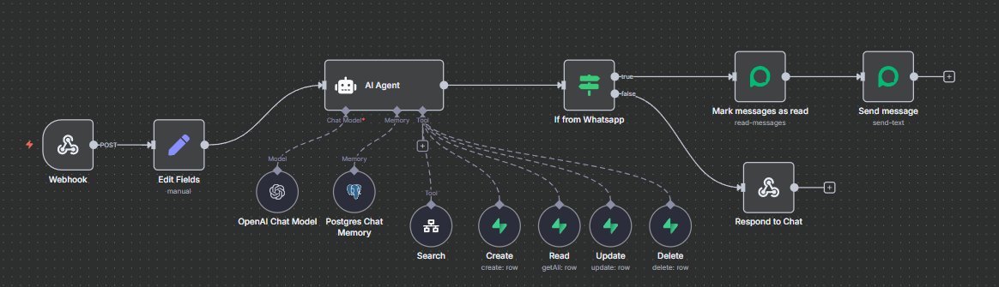
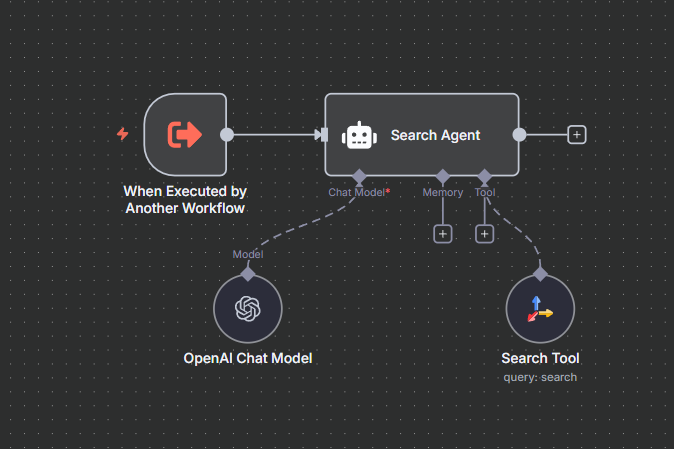

# 📋 Todo-IA - Smart Task List

A modern task management application built with Next.js 15, Supabase and TypeScript. Elegant interface, secure authentication and complete CRUD operations with automatic AI enhancement.

## 🚀 Overview

**Todo-IA** is a full-stack web application for personal task management that offers:

- ✅ **Complete authentication system** with Supabase Auth
- ✅ **Full CRUD operations** for tasks with Server Actions
- ✅ **Modern and responsive interface** with Tailwind CSS 4
- ✅ **Advanced security** with Row Level Security (RLS)
- ✅ **Optimized performance** with Next.js 15 and App Router
- ✅ **Intuitive user experience** with loading states
- 🤖 **Automatic AI enhancement** using OpenAI GPT-4o-mini
- 💬 **Smart chat** with integrated virtual assistant
- 📱 **Responsive design** mobile-first with Tailwind CSS 4
- 📝 **Markdown support** with React Markdown and remark-gfm
- 🌐 **Multi-language support** (English/Portuguese) with language toggle
- 📥 **Ready-to-use N8N workflows** for WhatsApp integration (downloadable)

## 🛠️ Technology Stack

### **Frontend**

- **[Next.js 15.5.0](https://nextjs.org/)** - React framework with App Router
- **[React 19.1.0](https://react.dev/)** - User interface library
- **[TypeScript 5](https://www.typescriptlang.org/)** - Static typing
- **[Tailwind CSS 4.1.12](https://tailwindcss.com/)** - Modern styling framework
- **[@tailwindcss/typography](https://github.com/tailwindcss/typography)** - Typography plugin

### **Backend & Database**

- **[Supabase](https://supabase.com/)** - Backend as a Service (BaaS)
- **PostgreSQL** - Relational database
- **Supabase Auth** - Authentication system
- **Row Level Security (RLS)** - Row-level security

### **Artificial Intelligence**

- **[OpenAI API](https://openai.com/)** - GPT-4o-mini for automatic enhancement and chat
- **Server Actions** - Asynchronous server processing
- **Prompt Engineering** - Optimized system for generating useful descriptions
- **[Tavily Search API](https://tavily.com/)** - Internet search capabilities for N8N workflows

### **Automation & Integration**

- **[N8N](https://n8n.io/)** - Workflow automation platform
- **[Evolution API](https://evolution-api.com/)** - WhatsApp integration service
- **PostgreSQL Memory** - Chat history persistence for N8N workflows
- **Webhook Integration** - Real-time message processing

### **Development Tools**

- **ESLint 9** - Code quality linter
- **PostCSS** - CSS processor with Tailwind CSS 4
- **React Markdown** - Markdown content rendering
- **remark-gfm** - GitHub Flavored Markdown support

## 🤖 N8N Workflows Architecture

The application uses two main N8N workflows to provide WhatsApp integration and intelligent task management:

### **1. TodoAI Workflow (Main Orchestrator)**

**Purpose**: Complete orchestration and user interaction via WhatsApp, performing CRUD operations on task lists and handling search requests.

**Key Features**:

- 📱 **WhatsApp Integration** - Receives and responds to user messages via Evolution API
- 🧠 **AI Agent** - Powered by OpenAI GPT-4o-mini with specialized task management prompts
- 💾 **Memory Management** - PostgreSQL-based chat history for context preservation
- 🔧 **CRUD Operations** - Full task management (Create, Read, Update, Delete) via Supabase
- 🔍 **Search Integration** - Delegates internet searches to the Search Agent workflow
- ✅ **Message Handling** - Automatic message reading and response functionality

**Workflow Components**:

- **Webhook** - Receives WhatsApp messages
- **AI Agent** - Processes requests and determines actions
- **Supabase Tools** - Handles database operations (Create, Read, Update, Delete)
- **Search Tool** - Calls the Search Agent workflow for internet queries
- **Evolution API** - Manages WhatsApp message sending and status updates
- **Memory System** - Maintains conversation context per user

**Visual Workflow:**



### **2. Search Agent Workflow (Internet Search)**

**Purpose**: Performs detailed internet searches based on terms requested by the main workflow.

**Key Features**:

- 🔍 **Internet Search** - Uses Tavily Search API for comprehensive web searches
- 🤖 **AI-Powered Results** - GPT-4o-mini processes and formats search results
- 📄 **Detailed Responses** - Returns formatted, relevant information in four detailed paragraphs
- 🔗 **Workflow Integration** - Designed to be called by other workflows

**Workflow Components**:

- **Workflow Trigger** - Receives search requests from parent workflows
- **Search Agent** - AI agent specialized in internet search
- **Tavily Search Tool** - Performs actual web searches
- **OpenAI Chat Model** - Processes and formats search results

**Visual Workflow:**



### **Integration Flow**

```
User WhatsApp Message → TodoAI Webhook → AI Agent Analysis
                                            ↓
                                   Decision Branch:
                                   ├── Task Management → Supabase CRUD
                                   ├── General Question → Direct AI Response
                                   └── Search Request → Search Agent Workflow
                                            ↓
                              Formatted Response → WhatsApp User
```

### **Workflow Visual Architecture**

The diagrams above demonstrate the complete N8N workflow structure:

1. **TodoAI Workflow**: Shows the main orchestration with WhatsApp integration, AI agent processing, and all CRUD operations
2. **Search Agent Workflow**: Displays the specialized search functionality with Tavily integration and AI-powered result formatting

These visual representations help understand the flow of data and the relationships between different components in the automation system.

### **📥 Download N8N Workflows**

You can download the complete workflow files to import directly into your N8N instance:

#### **� Workflow Files**

| Workflow            | Description                                                        | Download Link                                                                  |
| ------------------- | ------------------------------------------------------------------ | ------------------------------------------------------------------------------ |
| 🤖 **TodoAI Main**  | Complete WhatsApp integration with task management CRUD operations | [📄 Download todoai.json](./public/assets/workflows/todoai.json)               |
| 🔍 **Search Agent** | Internet search functionality for enhanced AI responses            | [📄 Download Search agent.json](./public/assets/workflows/Search%20agent.json) |

#### **📋 Quick Import Guide**

1. **📂 Download** the workflow files using the links above
2. **🔧 Open N8N** → Navigate to **Workflows** → **Import from File**
3. **📤 Upload** the downloaded JSON file
4. **🔑 Configure credentials** (Supabase, OpenAI, Evolution API, Tavily)
5. **✅ Activate** the workflow

#### **⚡ Quick Start Tips**

- 🔗 **Start with TodoAI workflow** for main functionality
- 🔍 **Add Search Agent** for enhanced search capabilities
- 📱 **Test with WhatsApp** before going live
- 🔐 **Secure your credentials** in N8N settings

> **⚠️ Important**: Before activating the workflows, ensure you have configured all the required credentials and API keys as described in the Environment Setup section.

## 📁 Project Structure

```
todo-ia/
├── src/
│   ├── app/
│   │   ├── dashboard/
│   │   │   ├── action.ts          # Server Actions for CRUD and AI
│   │   │   ├── layout.tsx         # Dashboard layout
│   │   │   └── page.tsx           # Main dashboard page
│   │   ├── chat/
│   │   │   ├── action.ts          # Server Actions for AI chat
│   │   │   ├── layout.tsx         # Chat page layout
│   │   │   └── page.tsx           # Smart chat page
│   │   ├── login/
│   │   │   ├── action.ts          # Authentication Server Action
│   │   │   ├── layout.tsx         # Login page layout
│   │   │   └── page.tsx           # Login page
│   │   ├── layout.tsx             # Root application layout
│   │   ├── page.tsx               # Landing/home page
│   │   ├── globals.css            # Global styles with Tailwind CSS 4
│   │   └── favicon.ico            # Application icon
│   ├── components/
│   │   ├── WhatsAppButton.tsx     # WhatsApp contact button
│   │   ├── N8NStatus.tsx          # N8N status component
│   │   └── LanguageToggle.tsx     # Language switcher component
│   ├── contexts/
│   │   └── LanguageContext.tsx    # Internationalization context
│   ├── hooks/
│   │   └── useChatHistory.ts      # Chat history hook
│   ├── services/
│   │   └── n8n-chat.ts           # N8N chat service
│   ├── types/
│   │   └── chat.ts               # Chat type definitions
│   ├── utils/
│   │   ├── chat-history.ts       # Chat history utilities
│   │   └── supabase/
│   │       ├── client.ts         # Supabase client (browser)
│   │       ├── server.ts         # Supabase client (server)
│   │       └── middleware.ts     # Authentication middleware
│   └── middleware.ts             # Global Next.js middleware
├── public/                       # Static files
│   ├── assets/                   # Images and visual resources
│   │   ├── todoai-agent.png      # TodoAI N8N workflow diagram
│   │   ├── search-agent.png      # Search Agent N8N workflow diagram
│   │   └── workflows/            # N8N workflow files for download
│   │       ├── todoai.json       # Main TodoAI workflow
│   │       └── Search agent.json # Search Agent workflow
│   └── *.svg                     # Other static assets
├── package.json                  # Dependencies and scripts
├── tsconfig.json                 # TypeScript configuration
├── postcss.config.mjs            # PostCSS configuration with Tailwind
├── eslint.config.mjs             # ESLint configuration
├── next.config.ts                # Next.js configuration
└── README.md                     # Project documentation
```

## 🎯 Features

### **🌐 Multi-language Support**

- **Language Toggle**: Button to switch between English and Portuguese
- **Default Language**: English (can be changed by user preference)
- **Persistent Selection**: Language preference saved in localStorage
- **Complete Translation**: All UI elements, messages, and placeholders
- **Responsive Design**: Language toggle integrated into all pages

### **🔐 Authentication**

- Secure login with email and password via Supabase Auth
- Persistent sessions with httpOnly cookies
- Automatic redirection based on authentication state
- Route protection middleware

### **📝 Task Management**

- **Create**: Add new tasks with title and description
- **View**: Organized list with filters (all, pending, completed)
- **Edit**: Modify existing tasks inline
- **Delete**: Remove tasks with confirmation
- **Toggle Status**: Mark as completed/pending
- **Expand**: View full or truncated descriptions

### **🤖 AI Enhancement**

- **Improvement Button**: "🤖 Improve with AI" button in forms
- **Smart Description**: AI analyzes title and description to create improved version
- **Manual Control**: User decides when to use AI
- **Visual Feedback**: Loading states during processing
- **Preview**: User sees generated description before saving
- **Markdown Support**: Generated descriptions include rich formatting

### **💬 Smart Chat**

- **Virtual Assistant**: Complete chat with AI for application questions
- **Smart Context**: AI understands conversation history
- **Personalized Responses**: Detailed explanations about features
- **Floating Widget**: Quick chat available on all pages
- **Smart Fallback**: Works even without AI configured
- **WhatsApp Interface**: Familiar and intuitive design

### **� WhatsApp Integration (N8N)**

- **Complete WhatsApp Bot**: Full task management via WhatsApp messages
- **Natural Language Processing**: AI understands user intentions in Portuguese/English
- **CRUD Operations**: Create, read, update, and delete tasks via chat commands
- **Smart Task Grouping**: Automatically groups related task details into single tasks
- **Internet Search**: Performs web searches when requested by users
- **Conversation Memory**: Maintains chat history and context per user
- **Auto Message Management**: Automatically marks messages as read and responds
- **Flexible Commands**: Supports natural language like "Add task: Buy bread" or "What are my tasks?"
- **Task References**: Smart handling of task references like "this task" or "the last task"
- **Confirmation System**: Confirms all operations with friendly messages

### **�📊 Smart Dashboard**

- Real-time statistics
- Visual filters by status
- Responsive interface (mobile-first)
- Loading states and visual feedback
- Modern design with micro-interactions
- Markdown support in descriptions

### **🔒 Security**

- Row Level Security (RLS) in Supabase
- Authentication verification in all operations
- CSRF protection with Server Actions
- Server-side data validation

## ⚙️ Environment Setup

### **Prerequisites**

- Node.js 18+
- npm, yarn, pnpm or bun
- Supabase account
- OpenAI API key (for AI functionality)
- N8N instance (for WhatsApp integration)
- Evolution API or similar WhatsApp API service
- Tavily Search API key (for internet search functionality)

### **1. Clone the repository**

```bash
git clone <repository-url>
cd todo-ia
```

### **2. Install dependencies**

```bash
npm install
# or
yarn install
# or
pnpm install
# or
bun install
```

### **3. Configure environment variables**

Create a `.env.local` file in the project root:

```env
# Supabase
NEXT_PUBLIC_SUPABASE_URL=https://your-url.supabase.co
NEXT_PUBLIC_SUPABASE_PUBLISHABLE_KEY=your-public-key

# OpenAI (for AI enhancement)
OPENAI_API_KEY=your-openai-key

# N8N (for WhatsApp integration)
N8N_WEBHOOK_URL=https://your-n8n-instance.com/webhook/your-webhook-id
N8N_API_KEY=your-n8n-api-key
```

> **Note**: AI functionality and WhatsApp integration are optional. The system will work normally without these configurations, but with limited features.

### **4. Configure Supabase database**

Run the following SQL in the Supabase SQL editor:

```sql
-- Create todos table
CREATE TABLE todos (
  id BIGINT PRIMARY KEY GENERATED ALWAYS AS IDENTITY,
  user_id UUID REFERENCES auth.users(id) ON DELETE CASCADE,
  task TEXT NOT NULL,
  description TEXT,
  is_complete BOOLEAN DEFAULT FALSE,
  inserted_at TIMESTAMP WITH TIME ZONE DEFAULT NOW()
);

-- Enable RLS
ALTER TABLE todos ENABLE ROW LEVEL SECURITY;

-- Policy for authenticated users
CREATE POLICY "Users can manage their own tasks"
ON todos
FOR ALL
USING (auth.uid() = user_id);

-- Performance indexes
CREATE INDEX idx_todos_user_id ON todos(user_id);
CREATE INDEX idx_todos_inserted_at ON todos(inserted_at DESC);
```

### **5. Configure N8N Workflows (Optional - for WhatsApp integration)**

If you want to enable WhatsApp integration, you'll need to set up the N8N workflows:

#### **Setup Requirements:**

- N8N instance (self-hosted or cloud)
- Evolution API or similar WhatsApp API service
- OpenAI API access
- Tavily Search API key
- PostgreSQL database for chat memory

#### **Import Workflows:**

1. **Download the workflow files** from the links provided in the "Download N8N Workflows" section above
2. Import the `todoai.json` workflow into your N8N instance
3. Import the `Search agent.json` workflow into your N8N instance
4. Configure the credentials for:
   - Supabase API (same as your main app)
   - OpenAI API (same as your main app)
   - Evolution API (for WhatsApp)
   - Tavily Search API (for internet search)
   - PostgreSQL (for chat memory storage)

> **Note**: The visual diagrams above show the complete workflow structure with all nodes and connections. These workflows provide the foundation for WhatsApp integration and intelligent task management.

#### **Configure Webhooks:**

1. In the TodoAI workflow, copy the webhook URL
2. Configure your WhatsApp API service to send messages to this webhook
3. Update the webhook URL in your application environment variables

#### **Test the Integration:**

1. Send a message to your WhatsApp number
2. Verify the workflow processes the message
3. Check that responses are sent back via WhatsApp

### **6. Run the project**

```bash
npm run dev
# or
yarn dev
# or
pnpm dev
# or
bun dev
```

Open [http://localhost:3000](http://localhost:3000) in your browser.

## 📱 How to Use

### **1. Language Selection**

- Use the language toggle button (🇺🇸 EN / 🇧🇷 PT) in the top navigation
- Available on all pages: home, login, dashboard, and chat
- Preference is automatically saved
- Interface updates immediately

### **2. Access**

- Access the application at `http://localhost:3000`
- Default language is English
- Login with your credentials
- You'll be redirected to the dashboard

### **3. Task Management**

- **Create**:
  1. Fill in the task title
  2. Optionally, enter an initial description
  3. Click "🤖 Improve with AI" to enhance the description
  4. Review the generated description
  5. Click "Add Task" to save
- **Filter**: Use "All", "Pending", "Completed" buttons
- **Edit**:
  1. Click the ✏️ icon on the task
  2. Modify title or description
  3. Use "🤖 Improve with AI" to enhance
  4. Click "💾 Save" to confirm
- **Complete**: Click the circle next to the task
- **Delete**: Click the 🗑️ icon (with confirmation)
- **Expand**: Click to see full description

### **4. AI Enhancement**

- **Manual Activation**: Click the "🤖 Improve with AI" button
- **Available in**: Creation form and edit mode
- **Process**:
  1. AI analyzes current title and description
  2. Generates improved and more detailed version
  3. User reviews before saving
- **Requirements**: Title required to use AI
- **Format**: Generated descriptions include Markdown for better organization

### **5. Smart Chat**

- **Complete Chat**: Access `/chat` for full AI conversation
- **Floating Widget**: Floating button in dashboard for quick chat
- **Smart Context**: AI remembers conversation history
- **Personalized Responses**: Explanations about application features
- **Smart Fallback**: Works even without AI configured

### **6. WhatsApp Integration**

If you have configured the N8N workflows, you can manage your tasks directly via WhatsApp:

#### **Task Management Commands:**

- **Create**: "Add task: Buy groceries" or "I need to study React"
- **List**: "What are my tasks?" or "Show me today's tasks"
- **Update**: "Mark 'Buy groceries' as complete" or "Update the last task"
- **Delete**: "Remove task 2" or "Delete the task 'Buy groceries'"

#### **Smart Features:**

- **Natural Language**: Use natural commands in Portuguese or English
- **Task Grouping**: Related details are automatically grouped into single tasks
- **Context Awareness**: Reference tasks with "this task" or "the last task"
- **Search**: Ask questions like "How to learn React?" for internet search
- **Confirmations**: All operations are confirmed with friendly messages

#### **Example Conversation:**

```
User: "Add task: Prepare presentation for Monday"
Bot: "Done! ✅ The task *Prepare presentation for Monday* has been added to your list."

User: "I need to research market trends and create slides"
Bot: "Perfect! ✅ I've updated the task to include the details: *Prepare presentation for Monday (research market trends and create slides)*."

User: "What are my tasks?"
Bot: "Here are your tasks:
1. Prepare presentation for Monday (research market trends and create slides) 📊
2. Buy groceries 🛒"
```

### **7. Dashboard**

- View real-time statistics
- Track task progress
- Interface optimized for productivity
- AI-enriched descriptions for better context
- Complete Markdown support in descriptions

## 🤖 AI Enhancement Examples

### **User Input:**

```
Title: "Study React"
Current Description: "Review basic concepts"
```

### **After clicking "🤖 Improve with AI" (with Markdown support):**

```markdown
## Objective

Deepen knowledge in **React** for modern web development, starting from reviewing fundamental concepts.

### Structured study plan:

#### 1. Basic Concepts (Review)

- Functional and class components
- Props and PropTypes
- Basic state management
- Event handling

#### 2. Essential Hooks

- `useState` for state management
- `useEffect` for side effects
- `useContext` for data sharing
- Custom hooks for reusable logic

#### 3. Applied Practice

1. Create a simple todo-list project
2. Implement CRUD operations
3. Add form validation

> **Tip**: Practice coding along with tutorials to better retain learning.

**Recommended Resources:**

- [Official React Documentation](https://react.dev)
- React Developer Tools
- Practical projects on CodeSandbox

**Estimated Time:** 2-3 weeks (1-2h/day)
```

### **Supported Markdown Features:**

- ✅ **Headers** (`#`, `##`, `###`)
- ✅ **Bold text** (`**text**`)
- ✅ **Italic text** (`*text*`)
- ✅ **Ordered lists** (`1. item`)
- ✅ **Unordered lists** (`- item`)
- ✅ **Inline code** (`code`)
- ✅ **Code blocks** (`code`)
- ✅ **Quotes** (`> text`)
- ✅ **Links** (`[text](url)`)
- ✅ **Tables** (GitHub Flavored Markdown)

## 📝 Available Scripts

```bash
# Development
npm run dev

# Production build
npm run build

# Run production build
npm run start

# Check code quality
npm run lint
```

## 🌐 Deployment

### **Vercel (Recommended)**

1. Connect your repository on [Vercel](https://vercel.com)
2. Configure environment variables
3. Automatic deployment on each commit

### **Other Platforms**

- Netlify
- Railway
- Render
- AWS Amplify

## 🔧 Troubleshooting

### **Problem: AI not working**

1. **Check API key:**

   ```bash
   # In .env.local file
   OPENAI_API_KEY=sk-proj-...
   ```

2. **Check server logs:**

   - Open development terminal
   - Look for OpenAI-related errors

3. **Test connectivity:**
   - Check if key has available credits
   - Confirm key has permissions for GPT-4o-mini model

### **Problem: Descriptions not appearing**

- AI processes in background, wait a few seconds
- Reload page if necessary
- Check browser console for errors

### **Fallback without AI**

If AI is not available:

- Use toggle to disable
- System will work normally without enhancement
- Manual descriptions continue working

### **Problem: N8N Workflows not working**

1. **Check workflow import:**

   - Ensure workflows were imported correctly
   - Verify all nodes are connected properly
   - Check for any error indicators on nodes

2. **Verify credentials:**

   ```bash
   # Required credentials in N8N:
   - Supabase API (URL + Service Key)
   - OpenAI API (API Key)
   - Evolution API (Instance + API Key)
   - Tavily Search API (API Key)
   - PostgreSQL (Host, Database, User, Password)
   ```

3. **Test webhook connectivity:**

   - Copy webhook URL from TodoAI workflow
   - Test with a simple POST request
   - Check N8N execution logs

4. **WhatsApp integration issues:**

   - Verify Evolution API instance is running
   - Check WhatsApp number is properly connected
   - Ensure webhook URL is configured in Evolution API settings

5. **Database connection problems:**
   - Test Supabase connection in N8N
   - Verify RLS policies allow workflow access
   - Check user_id is correctly passed to database operations

## 🤝 Contributing

1. Fork the project
2. Create a branch for your feature (`git checkout -b feature/new-feature`)
3. Commit your changes (`git commit -m 'Add new feature'`)
4. Push to branch (`git push origin feature/new-feature`)
5. Open a Pull Request

## 📋 Database Structure

### **Table: todos**

| Field         | Type      | Description                        |
| ------------- | --------- | ---------------------------------- |
| `id`          | BIGINT    | Primary key (auto-increment)       |
| `user_id`     | UUID      | Reference to authenticated user    |
| `task`        | TEXT      | Task title (required)              |
| `description` | TEXT      | Optional task description          |
| `is_complete` | BOOLEAN   | Completion status (default: false) |
| `inserted_at` | TIMESTAMP | Creation date/time                 |

## 🔧 Architecture

### **Internationalization**

- **React Context**: `LanguageContext` for global state management
- **Local Storage**: Persistent language preference storage
- **Translation Object**: Complete translations for EN/PT
- **Component Integration**: `LanguageToggle` component in all layouts
- **Default Language**: English (as requested)

### **Server Actions**

- All CRUD operations execute on server
- Optimized security and performance
- Automatic cache revalidation
- Asynchronous AI processing in background

### **Authentication Middleware**

- Sensitive route protection
- Session management
- Smart redirection

### **Reusable Components**

- Modular and scalable interface
- TypeScript for safe typing

### **N8N Workflows Architecture**

#### **TodoAI Workflow Structure:**

```
WhatsApp Webhook → Edit Fields → AI Agent
                                    ↓
                    ┌─────────────────┼─────────────────┐
                    ▼                 ▼                 ▼
                Supabase CRUD    Search Agent      Direct Response
                (Create/Read/    (Internet Search)  (AI Conversation)
                Update/Delete)        ↓                 ↓
                    ↓                 ▼                 ▼
                    └────────→ Evolution API ←─────────┘
                              (WhatsApp Response)
```

#### **Search Agent Workflow Structure:**

```
Workflow Trigger → Search Agent → Tavily Search Tool
                      ↓
                OpenAI Processing → Formatted Response
```

#### **Data Flow:**

1. **User Message** → WhatsApp → Evolution API → N8N Webhook
2. **Message Processing** → AI Agent analyzes intent
3. **Action Decision**:
   - Task CRUD → Supabase operations
   - Search Query → Search Agent workflow
   - General Chat → Direct AI response
4. **Response Generation** → Evolution API → WhatsApp → User

#### **Memory Management:**

- PostgreSQL stores chat history per user
- Context window of 10 messages
- Session management by user ID
- Persistent conversation state
- Tailwind CSS 4 for consistent styling
- Smart AI integration

### **Artificial Intelligence**

- **OpenAI GPT-4o-mini**: Model optimized for speed and cost
- **Prompt Engineering**: Optimized system for generating useful descriptions
- **Asynchronous Processing**: Doesn't block user interface
- **Graceful Fallback**: System works even without AI configured
- **Markdown Support**: Generated descriptions include rich formatting
- **Smart Chat**: Virtual assistant with conversation context
- **Contextual Responses**: AI understands conversation history

### **Tailwind CSS 4**

- **Modern Configuration**: Using PostCSS and native configuration
- **Typography Plugin**: Advanced typography support
- **Design System**: Consistent and responsive components
- **Mobile-First**: Interface optimized for mobile devices

## 📞 Support

For questions, problems or suggestions:

- Open an issue in the repository
- Contact the development team

---

**Developed by David Brigido**
